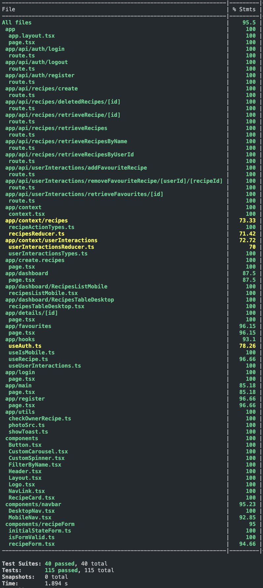

Recipe App (WIP)

# Recipe App (WIP)

## Technologies

- Next.js
- TypeScript
- PocketBase
- Jest and Supertest
- Cypress
- Tailwind CSS
- React Context API, custom hooks and React Reducer API
- Next.js Toast Notify / React Multi Carousel

## Features

- User Authentication (Login/Register)
- Chat between users (websockets in pocketbase)
- Chat with ChefGPT
- Create and Edit Recipes
- Recipe List View
- Recipe Search
- Responsive Design (Desktop/Mobile)
- Toast Notifications for Errors/Success
- Private Routes (Authenticated users only)
- Testing with Cypress
- Testing with Jest and Supertest
- Favourites System
- Session Persistence with cookies
- Dashboard Page (admin Panel for managing recipes)
- Recipe Rating System

## Upcoming Features

- Recipe API (for food data)
- Allergens Information
- Weekly Menu
- Pagination
- Recipe Comments System
- User-generated Recipe Collections
- Multi-language Support
- Dark Mode

## <h3>📊 Test Coverage (work in progress)</h3>

