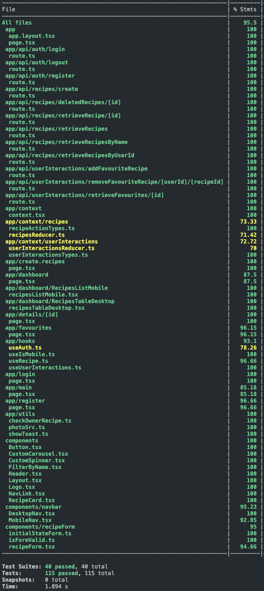

Recipe App (WIP)

## Demo video

👉 [Watch on YouTube](https://www.youtube.com/watch?v=Qm3sXgEUciU)

# Recipe App (WIP)

## Technologies

- Next.js
- TypeScript
- PocketBase
- Jest and Supertest
- Cypress
- Tailwind CSS
- React Context API, custom hooks and React Reducer API
- React Query (TanStack Query) for server state fetching and caching
- Next.js Toast Notify / React Multi Carousel

## Features

- User Authentication (Login/Register)
- Chat between users (websockets in pocketbase)
- Chat with ChefGPT
- Weekly Menu
- Create and Edit Recipes
- Recipe List View
- Recipe Search
- Filter recipe by name and by ingredients
- Responsive Design (Desktop/Mobile)
- Toast Notifications for Errors/Success
- Private Routes (Authenticated users only)
- Testing with Cypress
- Testing with Jest and Supertest
- Favourites System
- Session Persistence with cookies
- Dashboard Page (admin Panel for managing recipes)
- Recipe Rating System
- Recipe comments and comment likes system
- Allergens Information
- Send recipe mail

## Architecture

Most of the app follows a straightforward layered structure (Component → Hook → API route → Server function → PocketBase). For the **AI recipe generation feature**, a Hexagonal Architecture (Ports & Adapters) was introduced on purpose, since this is the part of the app most likely to change providers (e.g. swapping OpenAI for another model, or PocketBase for another database) and the one that benefits the most from being testable in isolation.

```
core/
  domain/generatedRecipe.ts        → domain type (GeneratedRecipe)
  ports/AIRecipeAssistant.ts       → contract: generateRecipe(userMessage)
  ports/RecipeSearcher.ts          → contract: searchByIngredients(ingredients)
adapters/
  ai/OpenAIRecipeAssistant.ts      → implements AIRecipeAssistant using OpenAI's
                                      function/tool-calling
  persistence/PocketBaseRecipeSearcher.ts → implements RecipeSearcher using PocketBase
app/api/userInteractions/aiChat/route.ts  → driving adapter (composition root):
                                             wires the concrete adapters and calls
                                             the ports, with no knowledge of OpenAI
                                             or PocketBase internals
```

- The **Core** (`core/`) only defines contracts (ports) and domain types. It has zero dependencies on Next.js, OpenAI or PocketBase.
- The **adapters** (`adapters/`) implement those contracts for a specific technology. `OpenAIRecipeAssistant` depends only on the `RecipeSearcher` port, never on `PocketBaseRecipeSearcher` directly — so the database engine or the AI provider could be swapped by changing a couple of lines in `route.ts`, without touching any business logic.
- This pattern was applied selectively to this feature, not the whole codebase — the rest of the app didn't need this level of isolation.

## Upcoming Features

- Pagination
- User-generated Recipe Collections
- Multi-language Support
- Dark Mode
- Migrate remaining manual data fetching (recipes, favourites, ratings) from the Context/Reducer hooks to React Query, following the same pattern already used for the comment count in `RecipeCard`

## <h3>📊 Test Coverage (work in progress)</h3>


