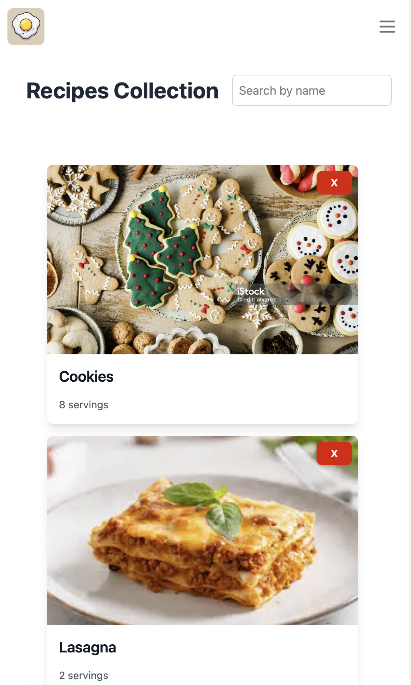
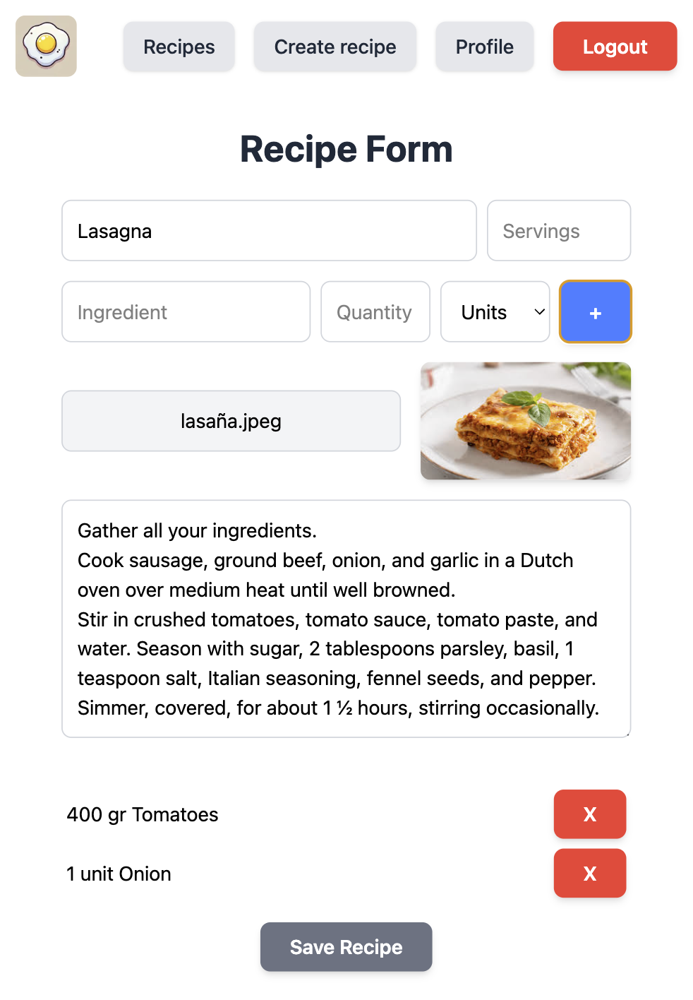

Recipe App (WIP)

# Recipe App (WIP)

## Technologies

- Next.js
- PocketBase
- Tailwind CSS
- Cypress
- TypeScript
- React Context API
- Next.js Toast Notify / React Multi Carousel

## Features

- User Authentication (Login/Register)
- Create and Edit Recipes
- Recipe List View
- Recipe Search
- Responsive Design (Desktop/Mobile)
- Toast Notifications for Errors/Success
- Private Routes (Authenticated users only)

## Upcoming Features

- Testing with Jest
- Favorites System
- Recipe Rating System
- Recipe API (for food data)
- Allergens Information
- Weekly Menu
- User Profile Page
- Admin Panel (for managing recipes)
- Recipe Comments System
- User-generated Recipe Collections
- Multi-language Support
- Dark Mode

  

